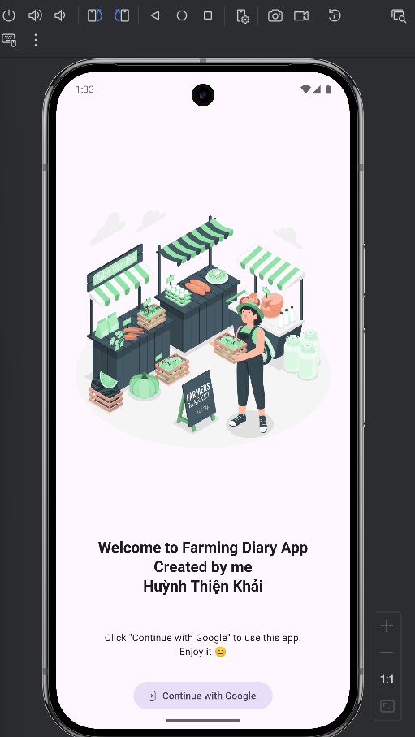

## link to clone in GitHub: 

# Flutter Submission

This submission contains only Dart code files organized into the following folders:

## Folder 1: Sum of Two Numbers
Contains Dart code that calculates the sum of two numbers.	    
**Result**:     
<figure style="text-align:center">
    
    <figcaption><em>Fig 1: Application at Start</em></figcaption>
       
    
    <figcaption><em>Fig 2: Input Error</em></figcaption>
       
    
    <figcaption><em>Fig 3: The result when input is ok</em></figcaption>
</figure>

## Folder 2: Simple Calculator
Contains Dart code for a basic calculator.		
**Result**:     
<figure style="text-align:center">
    
    <figcaption><em>Fig 4: The Simple Calculator</em></figcaption>
       
</figure>

## Folder 3: Inventory Management
Contains Dart code related to inventory management.  
**Result**:     
<figure style="text-align:center">
    
    <figcaption><em>Fig 5: The Simple Clock using <strong>flutter_analog_clock</strong> package</em></figcaption>
       
</figure>

## Folder 4: Farm ManagementManagement
Contains Dart code for a farm-related test.  
**Description**:    
Nhật ký trồng trọt và truy xuất nguồn gốc:
- Nhật ký trồng trọt: có chụp hình
	- giống cây
	- chăm sóc, bón phân,
	- phun thuốc
	- thu hoạch
	- bảo quản
- Truy xuất nguồn gốc: Quét mã QRCode
	- Đặc điểm 
	- Cơ sở sản xuất
	- Thông tin canh tác

**Directory Flow:**
| lib/  
|----| features/   
|----|----| nktt/    
|----|----|     activity_screen.dart    
|----|----|     field_lot_screen.dart    
|----|----| txng/     
|----|----|     create_qr_screen.dart      
|----|----|     scan_qr_screen.dart      
|----| models/     
|----|       farming_log_entry.dart    
|----|       field_lot.dart    
|----| screens/    
|----|        home_screen.dart     
|----|        onboarding_page.dart     
|----| services/database_helper.dart    
|----| widgets/custom_button.dart   
|     main.dart

**Result**:     
<figure style="text-align:center">
    
    <figcaption><em>Fig 6: Start UI is onboarding's UI</em></figcaption>
       
    
    <figcaption><em>Fig 7: Main screen interface of Farm application</em></figcaption>
       
    
    <figcaption><em>Fig 8: Field Lot interface of Farm app</em></figcaption>
       
    
    <figcaption><em>Fig 9: When Add Button is done in the Field Lot interface of Farm app</em></figcaption>
       
    
Click the "Lô: 01" and you can see this interface after use the add's button again to setting something.

    
    <figcaption><em>Fig 10: The active interface in Field Lot interface of the Farm app</em></figcaption>
       
</figure>
*Try it for fun. The result that is not show a lot. You can clone it to know how it work !*